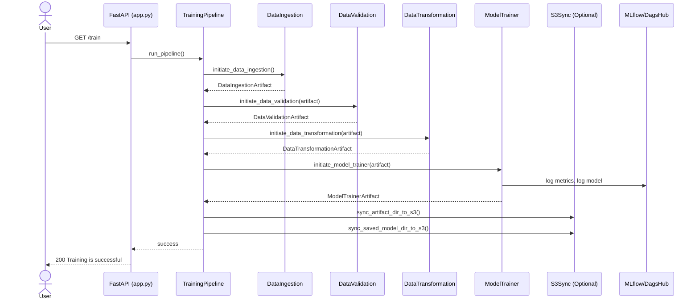
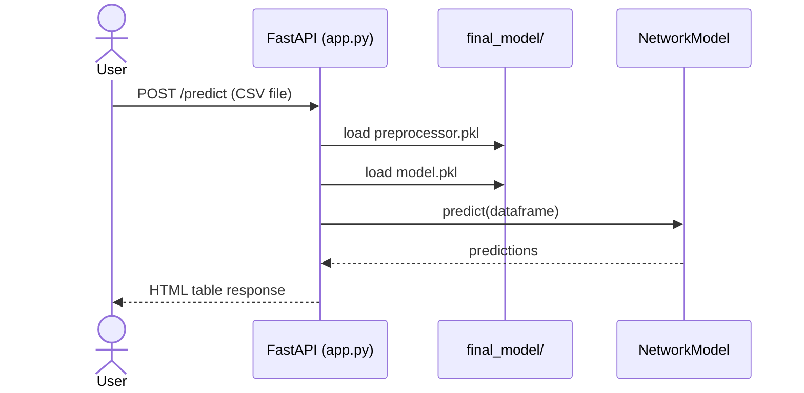

# Project Architecture

## Overview
This document expands the solution architecture with sequence and deployment views aligned to the current code and CI/CD workflow.

## Sequence Diagrams

### Training Trigger (`GET /train`)


### Prediction (`POST /predict`)


## Deployment Diagram
```mermaid
flowchart TB
    subgraph Dev[Developer]
        Code[Code Push to main]
    end

    subgraph CI[GitHub Actions]
        Build[Build Docker Image]
        Push[Push to ECR]
    end

    subgraph AWS[AWS]
        ECR[(Amazon ECR)]
        EC2[(Self-hosted Runner/EC2)]
        S3[(S3 Artifact Bucket)]
        Mongo[(MongoDB)]
    end

    subgraph Runtime[FastAPI Runtime]
        App[FastAPI Container]
        Models[final_model/]
    end

    Code --> Build --> Push --> ECR
    EC2 -->|docker pull| ECR
    EC2 -->|docker run| App
    App --> Models
    App -->|/train| Mongo
    App -->|sync (optional)| S3
```

## Key Paths
- `docs/solution_architecture.md` - Detailed system description.
- `app.py` - FastAPI endpoints for training and prediction.
- `networksecurity/pipeline/training_pipeline.py` - Orchestration logic.
- `.github/workflows/main.yaml` - CI/CD pipeline.
